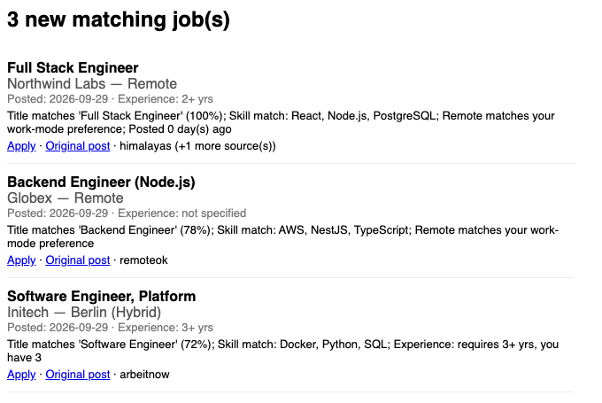

# job-scout

[](https://github.com/SyedMuhammadFaheem/job-scout/actions/workflows/tests.yml)
[](LICENSE)

**A free, self-hosted job radar that emails you new matching jobs every morning.**

job-scout runs on GitHub Actions once a day. It pulls from 10 free job sources, including LinkedIn posts through Google Alerts, scores each job against your resume profile, drops anything it has already sent you, and emails you the new matches through Gmail.

- **$0 to run:** no paid APIs, no servers, no scraping services.
- **No AI in the daily run:** matching is plain, transparent Python scoring. You use an LLM once, to turn your resume into `profile.json`.
- **Never repeats a job:** a SQLite history dedupes across days and across sources.
- **Configurable without code:** titles, keywords, experience, locations, and sources all live in one JSON file.

<p align="center"></p>

## How it works

```
GitHub Actions (cron) → fetch sources → normalize → match against profile.json
  → dedupe against SQLite → email new matches via Gmail SMTP → commit updated DB
```

## Quickstart (about 10 minutes)

1. **Create your own private copy.** Click **Use this template → Create a new repository** at the top of this page and choose **Private**. Your copy stores your job history, so keep it private.
2. **Create your profile.** Paste the prompt from [PROFILE_PROMPT.md](PROFILE_PROMPT.md) and your resume into any LLM chat. Save its two outputs as `profile.json` and `config.json` on your machine, then review them.
3. **Create a Gmail App Password.** Turn on 2-Step Verification, then create an App Password at [myaccount.google.com/apppasswords](https://myaccount.google.com/apppasswords).
4. **Add 4 secrets to your private copy.** With the [GitHub CLI](https://cli.github.com/):
   ```bash
   R=<you>/<your-private-repo>
   gh secret set CONFIG_JSON  -R $R < config.json
   gh secret set PROFILE_JSON -R $R < profile.json
   gh secret set GMAIL_ADDRESS -R $R          # the Gmail address that sends the digest
   gh secret set GMAIL_APP_PASSWORD -R $R     # 16 characters, no spaces
   ```
   You can also add them under Settings → Secrets and variables → Actions.
5. **Set your send time.** Edit the `cron:` line in `.github/workflows/daily-jobs.yml` to 9 AM in your timezone, converted to UTC (see [Scheduling](#scheduling)).
6. **Test it.** Open Actions → Daily job radar → **Run workflow**. You should get an email, and a `chore: update job database` commit should appear.

Until all 4 secrets are set, the daily workflow skips itself instead of failing.

### profile.json

Produced once from your resume. Schema:

```json
{
  "years_experience": 2,
  "titles": ["Software Engineer"],
  "skills": ["Python", "SQL"],
  "technologies": ["PostgreSQL", "AWS"],
  "domains": ["fintech"],
  "locations": ["Remote", "New York, NY"],
  "work_modes": ["remote"],
  "education": ["BS Computer Science"],
  "certifications": [],
  "keywords": ["backend", "distributed systems"],
  "exclude_keywords": ["senior", "staff", "principal"]
}
```

This is the permanent source of truth about you. It's read every day but never re-parsed or resent anywhere.

## Configuration

Everything in `config.json` is editable without touching code:

- `target_titles`, `include_keywords`, `exclude_keywords` — matched against job title/description/tags.
- `years_experience`, `locations`, `work_modes` — compatibility checks.
- `sources.<name>.enabled` — toggle any source on/off.
- `sources.greenhouse.companies` / `sources.lever.companies` — list of ATS company slugs to poll (see [Sources](#sources)).
- `matching.weights` — per-signal weight (title/skills/keywords/experience/location/recency) used by the scorer.
- `matching.min_score` — minimum score for a job to be considered a match.
- `max_daily_results` — cap on jobs emailed per day.
- `schedule` / `timezone` — documentation only; the actual trigger is the cron in the workflow file (see [Scheduling](#scheduling)).
- `email.to` — where the daily digest goes.

## Sources

All v1 sources are free and require no API key signup:

| Source | Type | Access |
|---|---|---|
| RemoteOK | API | `remoteok.com/api` |
| Remotive | API | `remotive.com/api/remote-jobs` |
| Arbeitnow | API | `arbeitnow.com/api/job-board-api` |
| Jobicy | API | `jobicy.com/api/v2/remote-jobs` |
| WeWorkRemotely | RSS | per-category feed |
| Himalayas | API | `himalayas.app/jobs/api` |
| HN "Who is hiring?" | Social (best-effort) | HN Algolia API — free text, no structured title/company, parsed heuristically |
| Greenhouse | ATS API | `boards-api.greenhouse.io/v1/boards/{company}/jobs` — **you supply company slugs** |
| Lever | ATS API | `api.lever.co/v0/postings/{company}` — **you supply company slugs** |
| Google Alerts (LinkedIn) | RSS (best-effort) | Google's own RSS export of a saved search — **you supply feed URLs**, see below |

**Excluded from direct access**: LinkedIn, Indeed, Glassdoor, AngelList/Wellfound have no public API/RSS, so scraping them directly would violate their ToS/robots.txt — the Google Alerts source below is how LinkedIn posts get caught without touching LinkedIn's access controls.

### Catching LinkedIn (and other blocked-site) posts via Google Alerts

LinkedIn's `robots.txt` blocks crawling its job pages, so this project never fetches LinkedIn directly. Instead, `google_alerts` reads the free RSS feed Google itself generates for a saved search — a first-party Google feature, not scraping.

Setup (repeat per search query you want to track):

1. Go to [google.com/alerts](https://www.google.com/alerts) (same Google account is fine).
2. Enter a query scoped to the site you want, e.g.:
   `site:linkedin.com/jobs "backend engineer" "python" "remote"`
3. Click **Show options**: set "Sources" to Web, "How many" to "All results" (or "Only the best results" for less noise).
4. Set **"Deliver to"** to **RSS feed** (not email).
5. Click **Create Alert**. An RSS icon appears next to the alert in your list — click it and copy that feed's URL.
6. Add the URL to `config.json`:
   ```json
   "google_alerts": { "enabled": true, "feed_urls": ["https://www.google.com/alerts/feeds/.../..."] }
   ```
7. Repeat for each exact query you want tracked (e.g. one per target title, or one per title+keyword combo).

Notes:
- This is best-effort like HN hiring: search snippets have no structured title/company/location fields, so `google_alerts.py` parses them heuristically from the entry title (`"Company hiring Title in Location"` pattern), falling back to the raw title if that pattern isn't present.
- Google Alerts updates its feed periodically (not instantly), which is fine for a once-daily digest.
- `application_url` points at the real LinkedIn (or other) post — Google Alerts links wrap it as a redirect, which the adapter unwraps.

### Sources wanted

These have free APIs that need a free key. PRs are welcome, see [CONTRIBUTING.md](CONTRIBUTING.md).

- [Adzuna](https://developer.adzuna.com/)
- [Jooble](https://jooble.org/api/about)
- [USAJobs](https://developer.usajobs.gov/)
- More public Greenhouse/Lever/Ashby company boards

### Adding a new source

See [CONTRIBUTING.md](CONTRIBUTING.md) for the rules and checklist. In short:

1. Create `src/adapters/<name>.py` with a class inheriting `SourceAdapter` (see `src/adapters/base.py`).
2. Implement `fetch()` (network call, use `self._get(url)` for built-in timeout/retry) and `normalize(raw)` (return a list of dicts via `self.make_job(...)`).
3. Register it in `ADAPTER_REGISTRY` in `src/adapters/__init__.py`.
4. Add an entry under `sources` in `config.json` with `"enabled": true`.

A broken adapter never crashes the run — `run_adapter()` in `base.py` isolates failures per source and logs them.

## Gmail SMTP setup

1. Enable 2-Step Verification on the sending Gmail account.
2. Create an [App Password](https://myaccount.google.com/apppasswords) (not your normal password).
3. Add it as the `GMAIL_APP_PASSWORD` secret (see below).

No SendGrid/Mailgun/SES/Postmark/Twilio — just `smtplib` over Gmail's SMTP.

## GitHub Secrets

Set these in repo Settings → Secrets and variables → Actions:

| Secret | Value |
|---|---|
| `GMAIL_ADDRESS` | the Gmail address sending the digest |
| `GMAIL_APP_PASSWORD` | the App Password from above |
| `CONFIG_JSON` | the full contents of your local `config.json` |
| `PROFILE_JSON` | the full contents of your local `profile.json` |

The workflow writes `CONFIG_JSON`/`PROFILE_JSON` out to `config.json`/`profile.json` at the start of each run, so your personal data never touches the repo itself.

## Scheduling

GitHub Actions cron is UTC-only and has no timezone/DST support. `.github/workflows/daily-jobs.yml` hardcodes a UTC cron (`0 4 * * *` = 9:00 AM Asia/Karachi). To match your own timezone:

1. Compute the UTC hour for 9:00 AM in your timezone.
2. Update the `cron:` line in the workflow file.
3. If your timezone observes DST and you care about staying at exactly 9am local, update it again twice a year.

`workflow_dispatch` is enabled, so you can always trigger a run manually from the Actions tab regardless of the cron.

## Persistence

The workflow commits the dedup database (`data/jobs.db`) back to your copy after each run. That is what keeps a job from being emailed twice across runs. The database also stores each job's match reasons, which reveal your skills, so keep your copy private.

## Running locally

```bash
python3 -m venv .venv && source .venv/bin/activate
pip install -r requirements.txt

cp config.example.json config.json    # edit with your real values
cp profile.example.json profile.json  # edit with your real values

# Dry run — prints the email instead of sending it, no Gmail creds needed
DRY_RUN=1 python -m src.pipeline

# Real send (needs GMAIL_ADDRESS / GMAIL_APP_PASSWORD env vars set)
python -m src.pipeline
```

## Tests

```bash
pip install -r requirements.txt
pytest tests/ -q
```

Tests use fixture payloads for adapter `normalize()` methods and mock data for matching/dedup/email — no network calls.

## Privacy

`profile.json`, `config.json`, and resume files are gitignored and never committed. The workflow reads them from GitHub Secrets. Only the placeholder `profile.example.json` and `config.example.json` ship in the repo.

## License

[MIT](LICENSE)
